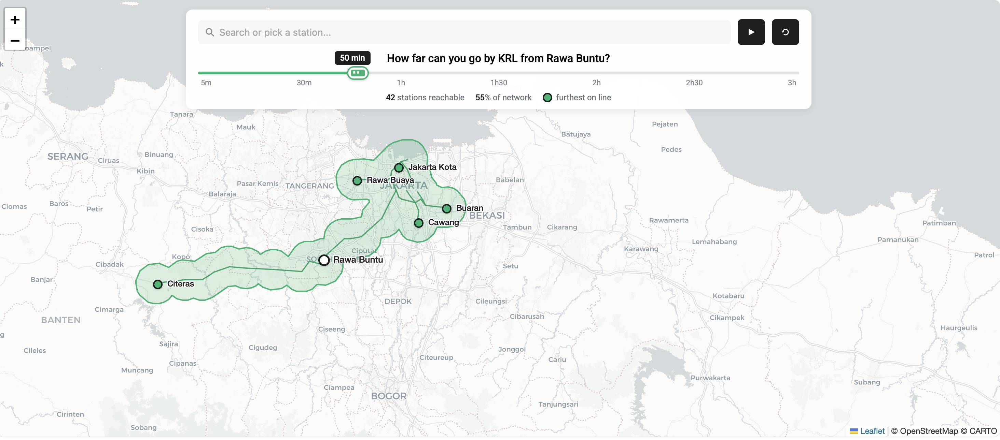

jalan2 paling enak naik transum

Inspired by none other than Chronotrains (https://www.chronotrains.com/en?city=Leuven%2CBE) Assisted by Claude <3 and sometimes ChatGPT when my Claude usage is over limit

# structure

```
krl_map.html
data/
  ├── stations.js    — 78 stations: { lat, lng, lines: [...] }
  ├── edges.js       — 79 edges: [from, to, lineCode, minutes]
  ├── lines.js       — line names, colors, transfer penalty
  └── landmarks.js   — nearby landmarks per station (dummy data)
```

# 

